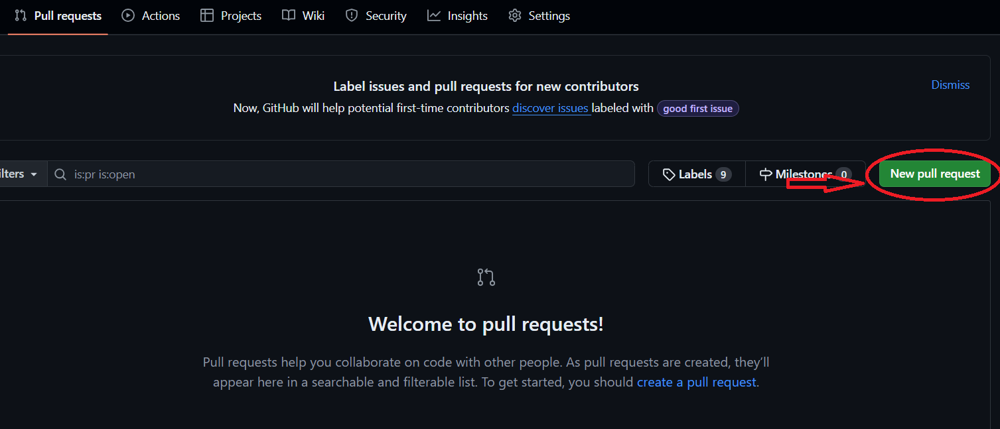

# Crear una Pull Request

En general subir código a una rama principal directamente es una mala idea. La razón es que si todos trabajamos sobre la misma rama sin un esquema de trabajo y sin una metodología más pronto que tarde se producirán conflictos y no pocos.

Para evitar que pase esto, se suele trabajar haciendo pull requests. Una pull Request no es más que una petición para que tus cambios sean incluidos dentro de una rama principal. Los repositorios de git siguen una forma similar a la de un árbol.


Cómo puedes ver en la imagen, tenemos una rama master (A veces llamada main como en nuestro caso) una rama develop y ramas llamadas feature.

## Master / Main

Esta es la rama principal. Aquí tienen que estar solo los cambios que son estables y que se ha probado que funcionan y son correctos. Esta rama es la versión definitiva de lo que desarollamos

## Develop

En esta rama tenemos una versión algo más inestable y con cosas que no se han probado lo suficiente. Esta rama se suele probar para asegurarnos de que todas las cosas que desarrollamos los distintos developers en cada rama se comportan como debe ser juntas en una misma rama.

## Feature

Cuando creamos una rama que con una forma similar a: 
```
feature/tarea00
```
Lo que queremos decir es que est rama contiene una nueva caracteristica que es tarea 00. Varias ramas que comiencen con `feature/` creará un grupo de ramas que nos ayudará más adelante a distinguir el tipo de rama.

## Hotfix

Cuando creamos una rama de hotfix o una rama de patch:
```
hotfix/tarea00
patch/tarea00
```
Lo que estamos dando a entender es que esa rama contiene un cambio para corregir un bug de forma rápida. A veces hay bugs que es necesrio que se corrijan con velocidad. Estas ramas se utilizan para eso. Hotfix se suele usar para cuando hay prisa y patch para cuando se hace con calma

## Notas finales

Estos solo son patrones generales y más o menos conocidos para trabajar en git. Cada equipo de desarrollo suele tener luego su propia manera de trabajar. Lo que está claro es que debes entender cómo cambiar de rama, crear ramas y cómo hacer commits en diferentes ramas.

## Objetivo de la tarea 01

**La rama main y la rama develop ahora están protegidas**

Esto quiere decir que ya no vas a poder subir cambios directamente en ellas. Podrías crear commits en tu rama local main o tu rama local develop pero no podrás subirlos a las ramas remotas. 

Para poder subir un commit tienes que subir tu código nuevo a una rama:

```
feature/tarea01
```

Y luego crear una pull request para unir esos cambios a la rama develop. Los cambios que sean crear un fichero .txt dentro de la carpeta 01 que diga:

```
Mi primera Pr
```

## Comandos que tendrás que usar para esta tarea:

```bash
git pull
git checkout
git branch
git commit
git push
```

**SIEMPRE QUE PONGAMOS EN LOS PATRONES DE COMANDOS <COSA> QUIERE DECIR QUE HAY QUE SUSTITUIR TODA LA PALABRA INCLUYENDO LOS SÍMBOLOS (<>). USAMOS LA FORMA <TEXTO_A_SUSTITUIR> PARA QUE SE DISTINGA DEL RESTO DE PARTES DE LOS COMANDOS**

### Proceso para subir cambios a un repositorio:

1. Descargar los cambios en tu versión local del repositiorio con `git pull`
2. Cambiar a la rama develop con `git checkout <rama objetivo>`
3. Creamos la rama para la tarea nueva con `git branch <nombre de la nueva rama>`
4. Cambiamos a la rama nueva con `git checkout <rama objetivo>`
5. Hacemos los cambios pedidos en la tarea en el código
6. Consultamos el estado del repositio local y remoto con `git status`
7. Stageamos los ficheros que queremos añadir al commit con `git add <nombre del fichero>` de uno en uno, o si queremos añadir todos los ficheros sin excepción `git add *`
8. Una vez stageados todos los ficheros que queremos subir podemos volver a comprobar con `git status` si ahora en vez de en rojo salen sus nombres en verde
9. Usamos `git commit <texto commit>` y creamos un commit con los cambios al código
10. Finalmente pusheamos el código con `git push`

Solo resta ir a la página web de github o del repositorio y crear desde ahí una pull request.



Con este botón en la pestaña de pull request puedes crear una pull request que apunte los cambios de `feature/tarea01` a `develop`